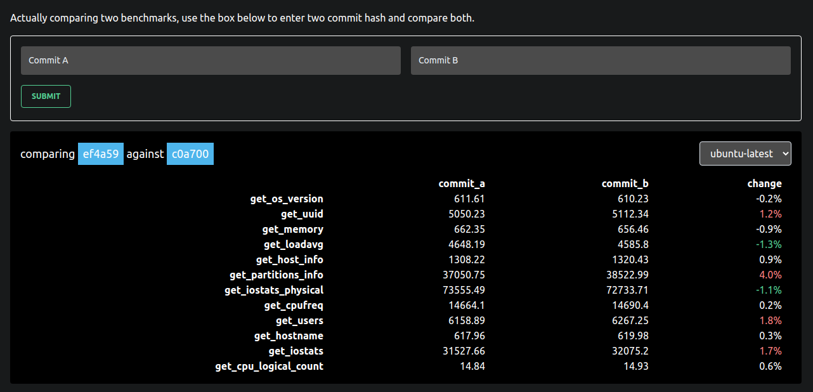

<div align="center">
  <h1>Perf-ci</h1>
  <p>
    <strong>Criterion Comparison across git repo</strong>
  </p>
  <p>

[](LICENSE)

  </p>
</div>

Perf-ci is intended to recieve data from Github CI's runs.

This project is meant to evolve in something more complete and more complexe in a somewhat near future.

What
--------------------------

Perf-ci work in pair with a python script created to gather Rust's Criterion result of benchmarks. The little script send the data to this server which then display the data on a UI (web-app).

From the UI you can/will see all your commit and tags which had a Criterion's benchmark. You will then be able to select two commits/tags and compare their result.

Server setup / Dev setup
--------------------------

- Install all deps
```bash
$ curl --proto '=https' --tlsv1.2 -sSf https://sh.rustup.rs | sh
# postgresql-12 is optional
$ sudo apt-get install libpq-dev postgresql-12
# start the pg server only if you installed it in the prev step
$ pg_ctlcluster 12 main start
$ cargo install diesel_cli --no-default-features --features postgres
```

- Create a .env file based on .env.example
```bash
$ diesel setup
```

Example
--------------------------



Live demo: [perf-ci.speculare.cloud](https://perf-ci.speculare.cloud/?a=c0a700596c4366b65855083bdd2f8719e95ee0a1&b=ef4a59f3f1c9b7047ee663622f1ec87cb2bf26f1) related to the [sys_metrics](https://github.com/Martichou/sys_metrics) repository.

Contributing
--------------------------

Pull requests are welcome. For major changes, please open an issue first to discuss what you would like to change.